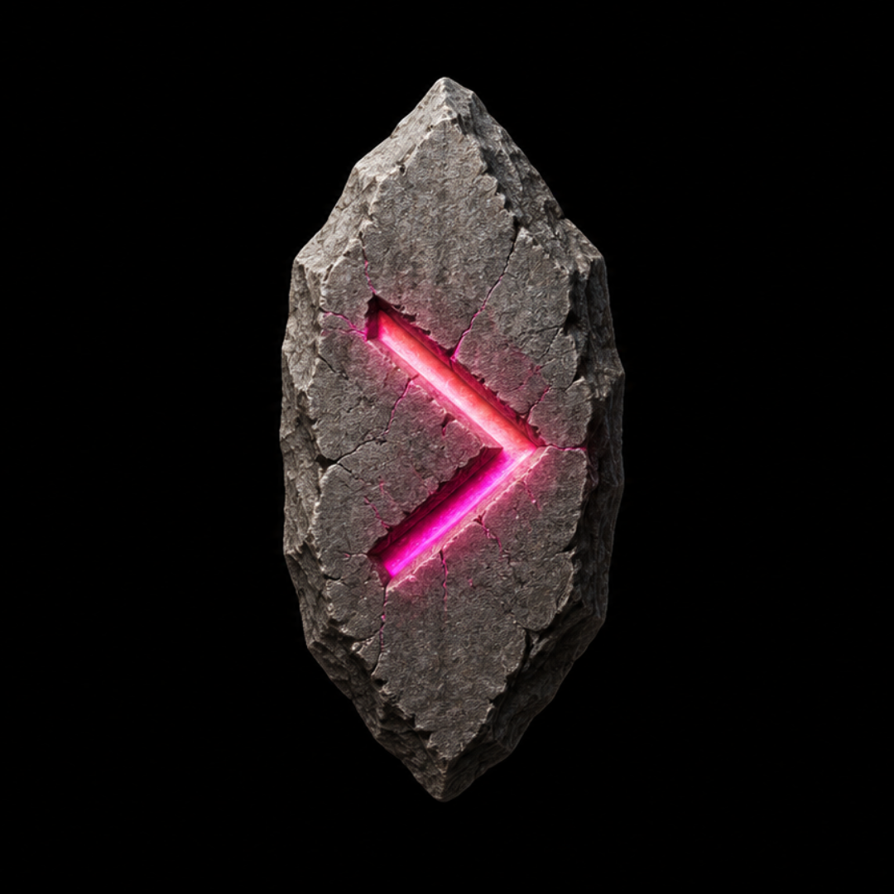

# Rune Kernel

*A modern x86_64 kernel built completely from scratch.*

 

---

## About

Rune Kernel is a custom **x86_64 operating system kernel** written entirely from scratch in C.

The long-term goal of this project is to create a fully open-source kernel ecosystem with planned support for custom distributions and low-level system development experimentation.

The project currently uses the **Limine bootloader** for boot initialization and modern x86_64 boot compatibility.

---

## License

This project is licensed under the **GNU General Public License (GPL)**.

See the [LICENSE](LICENSE) file for more information.

---

## Contributors Wanted

Rune Kernel is currently in an early alpha stage and contributors are welcome.

If you have experience with:

- C programming
- Low-level systems development
- x86_64 architecture
- Operating system internals

and want to help build an open-source kernel project, feel free to contribute.
